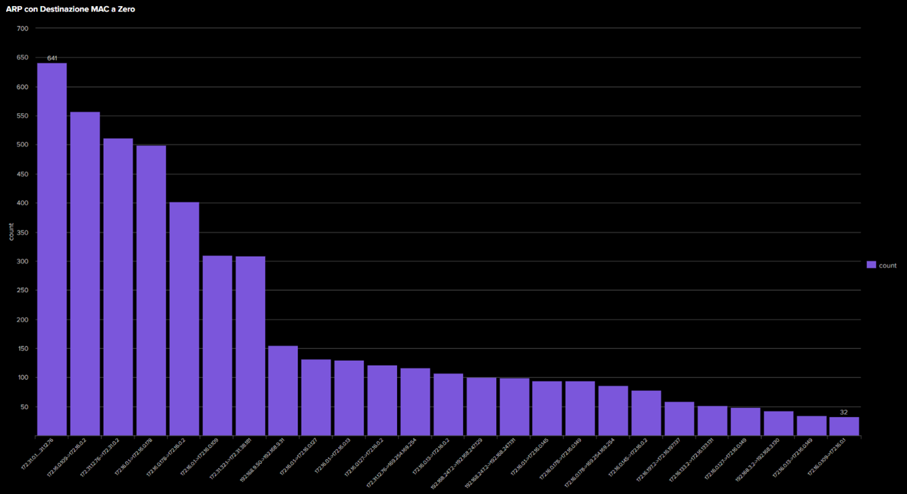
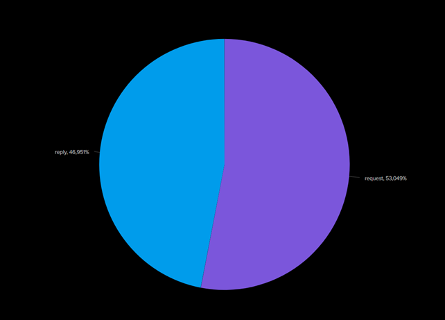
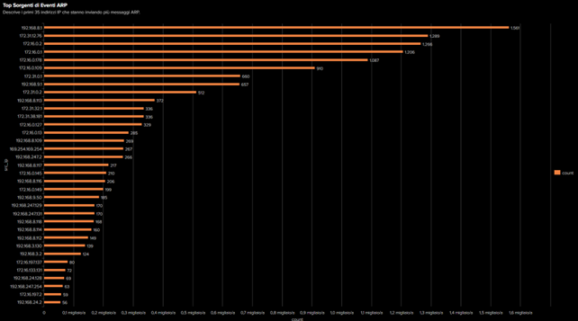
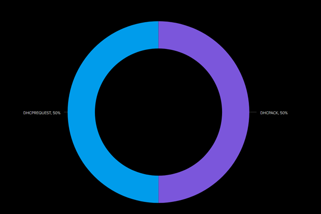
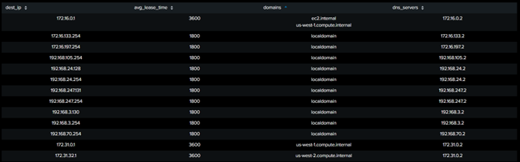
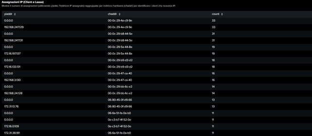

# Analisi ARP/DHCP

Questa cartella contiene le query Splunk e le relative visualizzazioni per l'analisi dei protocolli ARP e DHCP

---

## Query 1: Analisi delle Richieste ARP con Destinazione MAC Null


```spl
index=botsv3 sourcetype=stream:arp arp_dest_mac="00:00:00:00:00:00"
| eval pair = src_ip . "->" . dest_ip
| stats count by pair
| sort – count
```


---

## Query 2: Distribuzione del Traffico ARP per Tipo di Operazione

```spl
index=botsv3 sourcetype=stream:arp 
| stats count by opcode 
| sort – count
```


---

## Query 3: Top Host per Traffico ARP Generato


```spl
index=botsv3 sourcetype=stream:arp 
| stats count by src_ip 
| sort - count 
| head 35

```


---

## Query 4: Distribuzione dei Messaggi DHCP per Tipo di Operazione

```spl 
index=botsv3 sourcetype=stream:dhcp 
| stats count by opcode 
| sort – count
```


---

## Query 5: Configurazione dei Server DHCP

```spl 
index=botsv3 sourcetype=stream:dhcp
| stats avg(ip_lease_time) as avg_lease_time, values(domain_name{}) as domains, values(dns_server{}) as dns_servers by dest_ip
| sort - avg_lease_time

```


---
## Query 6: Assegnazione degli Indirizzi IP tramite DHCP

```spl 
index=botsv3 sourcetype=stream:dhcp 
| stats count by yiaddr, chaddr
| sort – count

```


---


