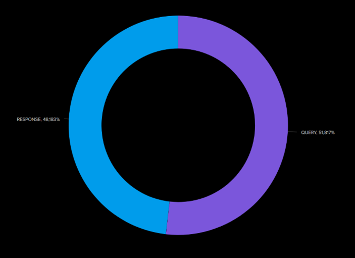
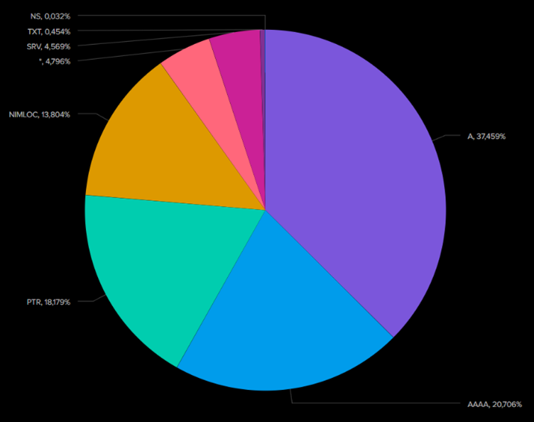
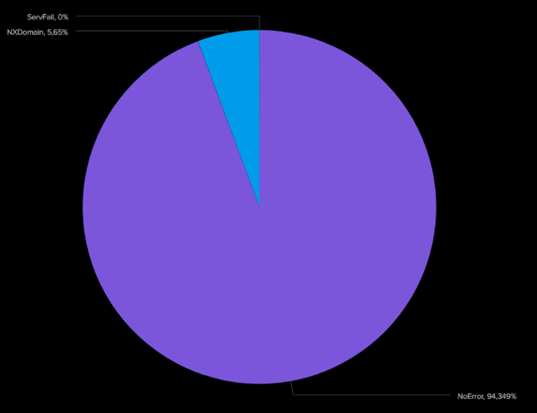
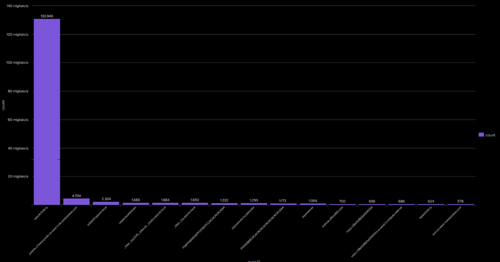

# Analisi Protocollo DNS

Questa sezione contiene le query Splunk utilizzate per analizzare il traffico DNS nel dataset BOTSv3, con le relative visualizzazioni.

---

## Query 1: Distribuzione dei tipi di messaggi richiesti 

```spl
index=botsv3 sourcetype=stream:dns
| stats count by message_type{}
| sort - count
```

 
---

## Query 2: Distribuzione dei Tipi di Query DNS

```spl
index=botsv3 sourcetype=stream:dns 
| stats count by query_type
| sort – count
```


---

## Query 3: Analisi dei Codici di Risposta DNS

```spl
index=botsv3 sourcetype=stream:dns
| stats count by reply_code
| sort – count
```


---

## Query 4: Top 15 Query risolte 

```spl 
index=botsv3 sourcetype=stream:dns 
| stats count by query{}
| sort - count
| head 15
```


---

## Query 5: Analisi dei server DNS più utilizzati

```spl 
index=botsv3 sourcetype=stream:dns 
| mvexpand hostname{}
| stats count by hostname{}
| sort - count
|  head 15
```


---


