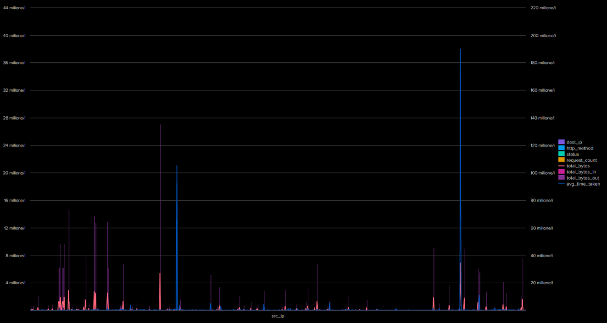
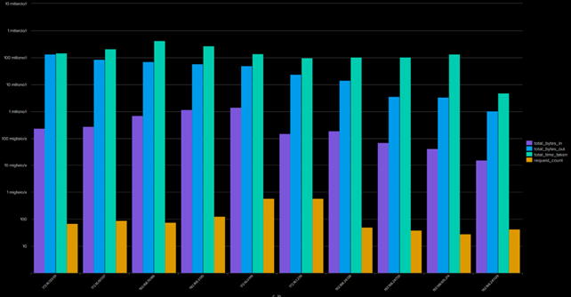
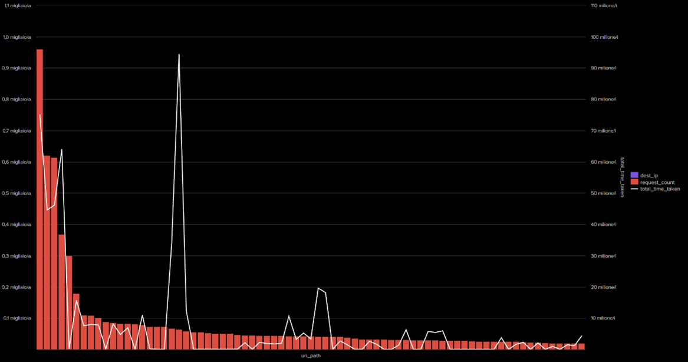
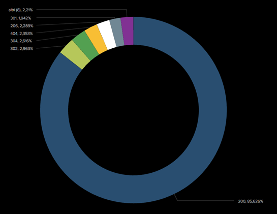
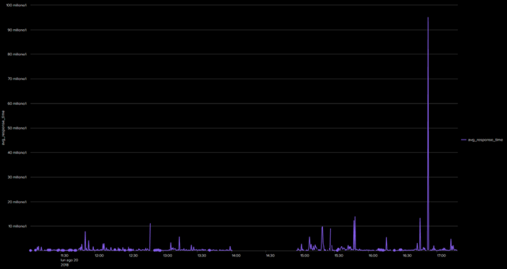

# Analisi Protocollo HTTP

Questa sezione contiene le query Splunk utilizzate per analizzare il traffico HTTP nel dataset BOTSv3, con le relative visualizzazioni.

---

## Query 1: Analisi Generale del Traffico HTTP
 

```spl
index=botsv3 sourcetype=stream:http
| stats count as request_count, sum(bytes) as total_bytes, sum(bytes_in) as total_bytes_in, sum(bytes_out) as total_bytes_out, avg(time_taken) as avg_time_taken by src_ip, dest_ip, http_method, status
```

 
---

## Query 2: Analisi Client HTTP
 

```spl 
index=botsv3 sourcetype=stream:http 
|stats sum("sum(bytes_in)") as total_bytes_in, sum("sum(bytes_out)") as total_bytes_out,sum("sum(time_taken)") as total_time_taken, count as request_count by c_ip 
| sort - total_bytes_out 
| head 10
```


---

## Query 3: Analisi dei maggior URI richiesti

```spl
index=botsv3 sourcetype=stream:http 
| stats sum(count) as request_count, sum("sum(bytes_in)") as total_bytes_in, sum("sum(bytes_out)") as total_bytes_out,  sum("sum(time_taken)") as total_time_taken by site, uri_path, dest_ip 
| sort - request_count 
| head 75
```


---

## Query 4: Analisi STATUS http

```spl 
index=botsv3 sourcetype=stream:http 
| stats count by status 
| sort - count
```


---

## Query 4: Analisi dei Tempi di Risposta

```spl 
index=botsv3 sourcetype=stream:http 
| timechart span=30s avg("sum(time_taken)") as avg_response_time
```


---


