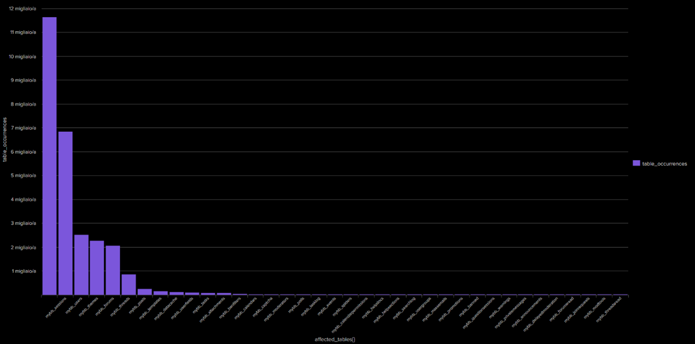
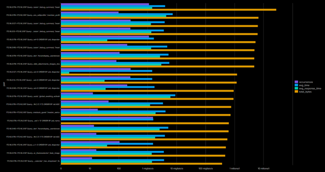
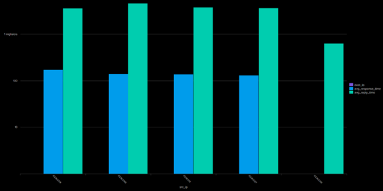
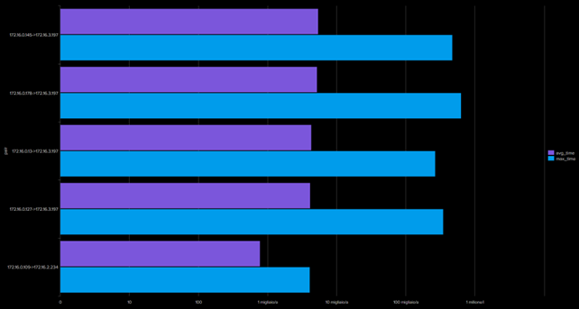
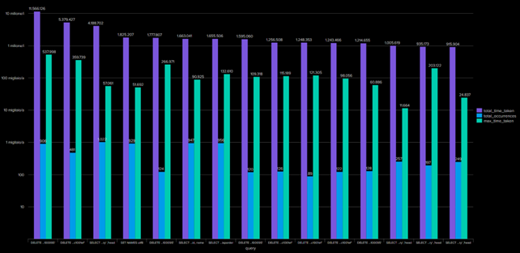

# Analisi Protocollo MySQL

Questa sezione contiene le query Splunk utilizzate per analizzare il traffico MySQL nel dataset BOTSv3, con le relative visualizzazioni.

---

## Query 1: Identificazione delle tabelle più frequentemente accedute nel sistema 


```spl
index=botsv3 source=stream:mysql 
| mvexpand affected_tables{} 
| stats count as table_occurrences by affected_tables{} 
| sort - table_occurrences

```


---

## Query 2: Analisi delle query ad alto volume e latenza

```spl 
index=botsv3 source=stream:mysql 
| eval pair = src_ip . "->". dest_ip . " Query: " . query 
| stats count as occurrences, avg(time_taken) as avg_time, avg(response_time) as avg_response_time, sum(bytes) as total_bytes by pair 
| sort - total_bytes | head 20

```


---

## Query 3: Monitoraggio dei Tempi di Risposta

```spl
Monitoraggio dei Tempi di Risposta
index=botsv3 source=stream:mysql 
| stats avg(response_time) as avg_response_time, avg(reply_time) as avg_reply_time by src_ip, dest_ip 
| sort - avg_response_time
```


---

## Query 4: Analisi dei Tempi di Esecuzione per Sorgente-Destinazione


```spl
index=botsv3 sourcetype=stream:mysql 
| stats avg("sum(time_taken)") as avg_time, max("max(time_taken)") as max_time by src_ip, dest_ip 
| sort - avg_time 
| eval pair = src_ip . "->" . dest_ip 
| table pair,avg_time,max_time

```


---


## Query 5: Top Query per Tempo di Esecuzione


```spl
index=botsv3 sourcetype=stream:mysql 
| where isnotnull(query) AND query!="" 
| stats sum(count) as total_occurrences, sum("sum(time_taken)") as total_time_taken, max("max(time_taken)") as max_time_taken by query, src_ip, dest_ip 
| sort - total_time_taken 
| head 15

```


---


