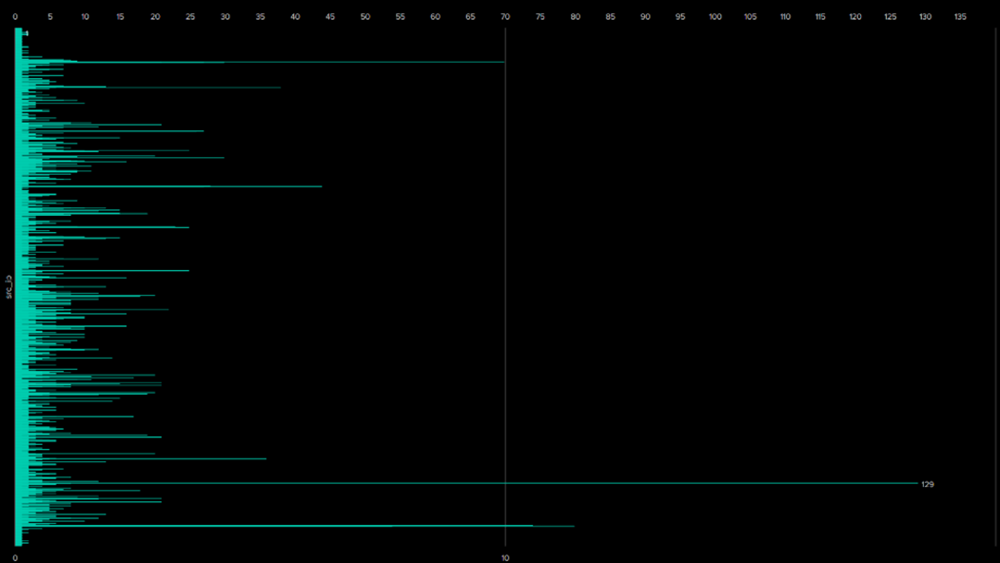
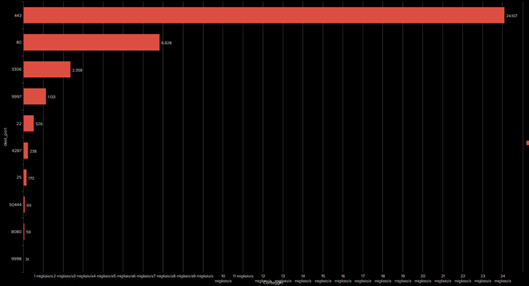
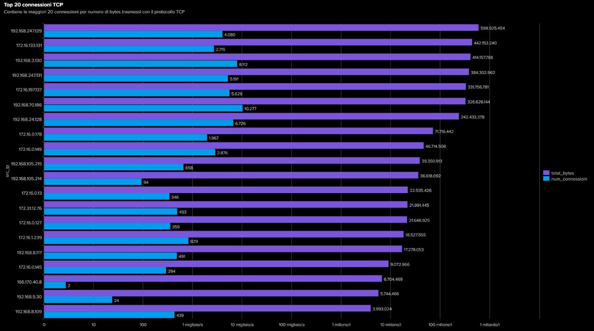
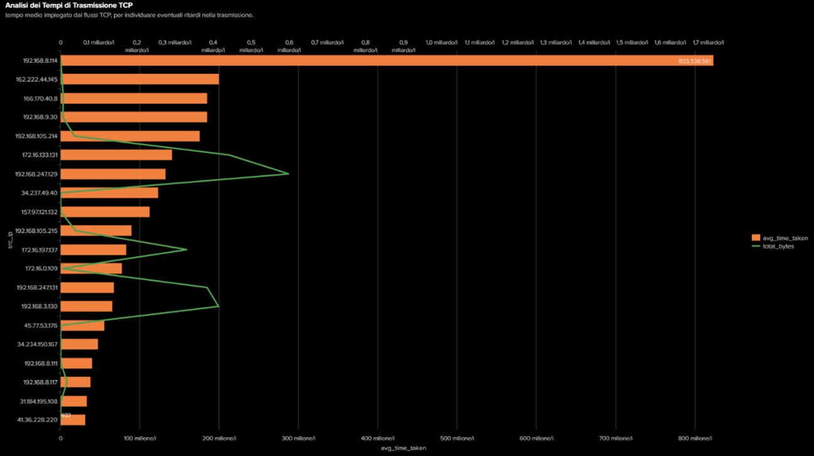
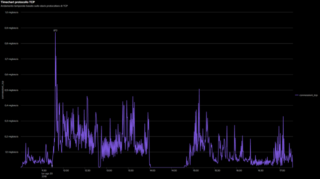

# Analisi Protocollo TCP

Questa sezione contiene le query Splunk utilizzate per analizzare il traffico TCP nel dataset BOTSv3, con le relative visualizzazioni.

---

## Query 1: Connessioni interrotte TCP

```spl
index=botsv3 sourcetype=stream:tcp canceled=1 
| stats count AS connessioni_interrotte, values(flow_id) AS flow_ids by src_ip, dest_ip, dest_port 
| table src_ip, dest_ip, dest_port, connessioni_interrotte, flow_ids

```


---

## Query 2: Distribuzione porte TCP

```spl 
index=botsv3 sourcetype=stream:tcp 
| stats count by dest_port  
| sort -count 
| head 10

```


---

## Query 3: Top 20 connessioni TCP per host

```spl
index=botsv3 sourcetype=stream:tcp 
| stats count AS num_connessioni, sum(bytes) AS total_bytes by src_ip 
| sort - total_bytes 
| head 20

```


---

## Query 4: Analisi dei tempi di trasmissione TCP

```spl
index=botsv3 sourcetype=stream:tcp
| stats avg(time_taken) AS avg_time_taken, sum(bytes) AS total_bytes by src_ip
| sort - avg_time_taken

```


---


## Query 5: Timechart delle connessioni TCP

```spl

index=botsv3 sourcetype=stream:tcp 
| timechart span=30s count AS connessioni_tcp

```


---


