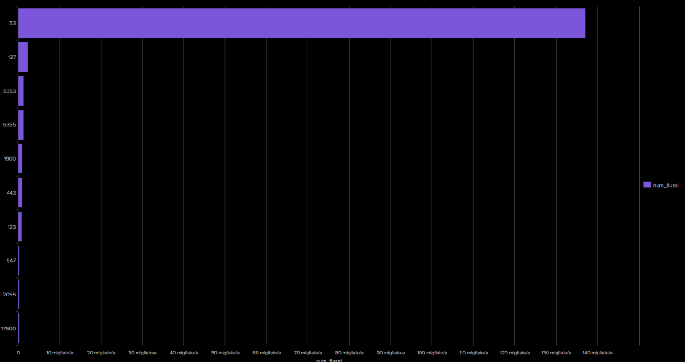
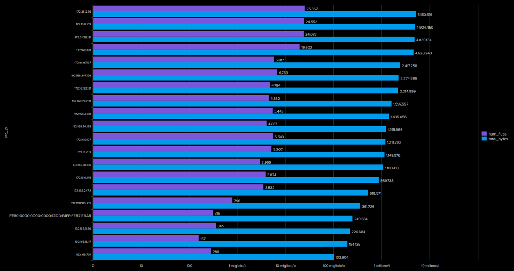
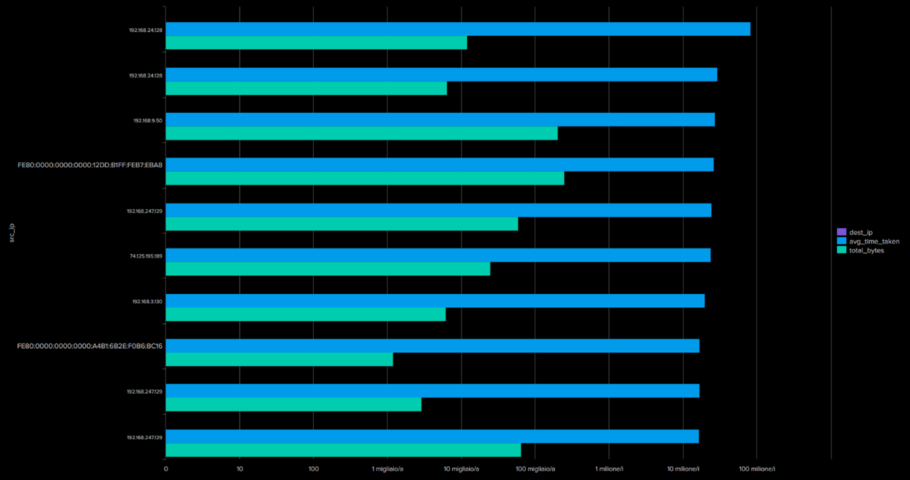
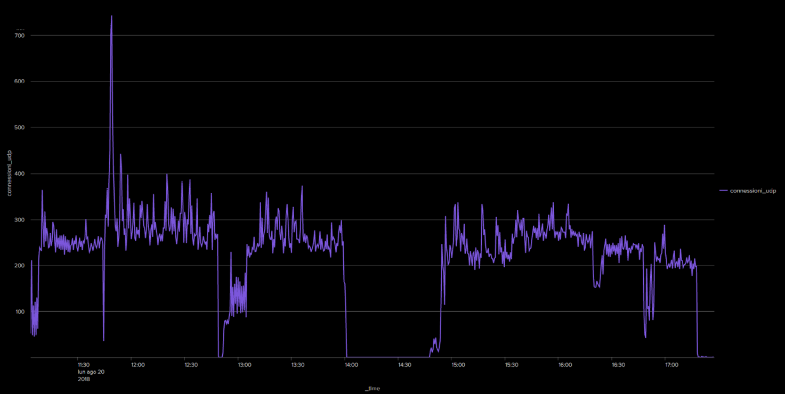

# Analisi Protocollo UDP

Questa sezione contiene le query Splunk utilizzate per analizzare il traffico UDP nel dataset BOTSv3, con le relative visualizzazioni.

---

## Query 1: Distribuzione delle Porte di Destinazione UDP

```spl
index=botsv3 sourcetype=stream:udp 
| stats count AS num_flussi by dest_port 
| sort - num_flussi 
| head 10
```

 
---

## Query 2: Top Indirizzi Sorgenti per UDP

```spl 
index=botsv3 sourcetype=stream:udp 
| stats count AS num_flussi, sum(bytes) AS total_bytes by src_ip 
| sort - total_bytes 
| head 20
```


---

## Query 3: Analisi dei Tempi di Trasmissione UDP


```spl
index=botsv3 sourcetype=stream:udp 
| stats avg(time_taken) AS avg_time_taken, sum(bytes) AS total_bytes by src_ip, dest_ip 
| sort - avg_time_taken 
| head 10
```


---

## Query 4: Timechart per protocollo UDP

```spl
index=botsv3 sourcetype=stream:udp
| timechart span=30s count AS connessioni_udp
```


---


