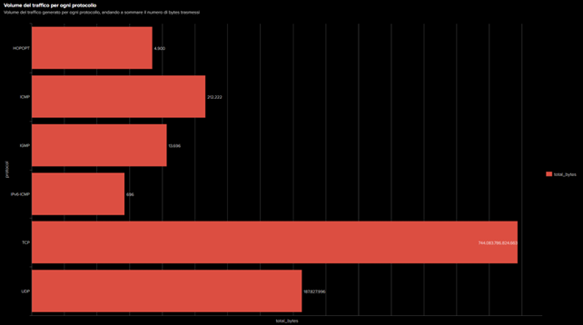
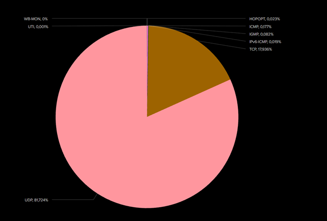
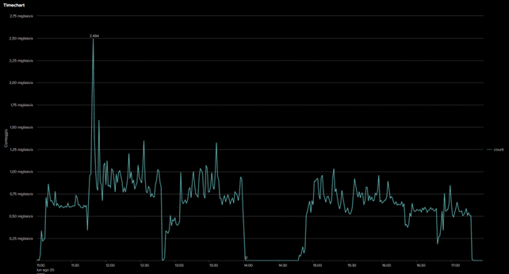
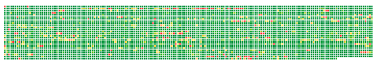
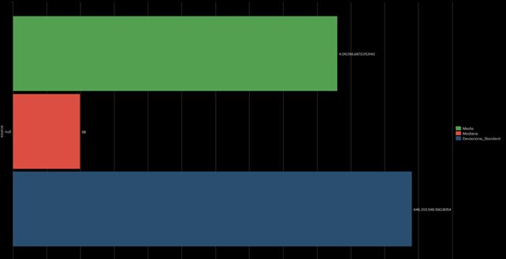
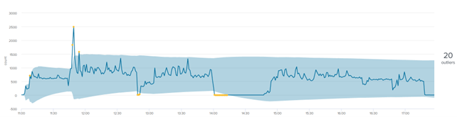
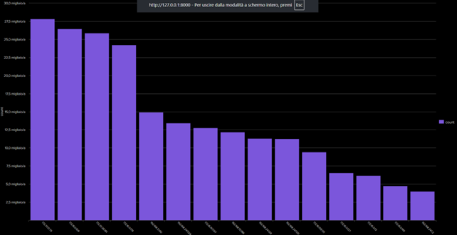

# Analisi Protocollo IP

Questa sezione contiene le query Splunk utilizzate per analizzare il traffico IP nel dataset BOTSv3, con le relative visualizzazioni.

---

## Query 1: Volume traffico per protocollo

```spl
index=botsv3 sourcetype=stream:ip
| stats sum(bytes) as total_bytes by protocol
| where total_bytes > 5
```


---

## Query 2: Protocolli utilizzati

```spl
index=botsv3 sourcetype=stream:ip 
| stats count by protocol
```


---

## Query 3: Timechart

```spl
index=botsv3 sourcetype=stream:ip 
| timechart span=1m count

```


---

## Query 4: Heatmap

```spl
index=botsv3 sourcetype=stream:ip 
| stats count AS value by src_ip, dest_ip 
| eval tooltip = "SRC: " . src_ip . " | DEST: " . dest_ip . " | COUNT: " . value
| table value tooltip src_ip dest_ip

```


---


## Query 5: Media, Mediana e Deviazione Standard

```spl
index=botsv3 source=stream:ip 
| stats avg(bytes) AS Media, median(bytes) AS Mediana, stdev(bytes) AS Deviazione_Standard
| table source,Media, Mediana, Deviazione_Standard

```


---


## Query 6: Outliner chart

```spl
index=botsv3 sourcetype=stream:ip 
| timechart span=1m count 
| streamstats avg(count) as avg stdev(count) as stdev
| eval upper_bound = avg + 2*stdev, lower_bound = avg - 2*stdev
| table _time, count, lower_bound, upper_bound

```


---

## Query 7: Top 15 IP sorgenti

```spl
index=botsv3 sourcetype=stream:ip 
| stats count by src_ip 
| sort -count 
| head 15

```


---


